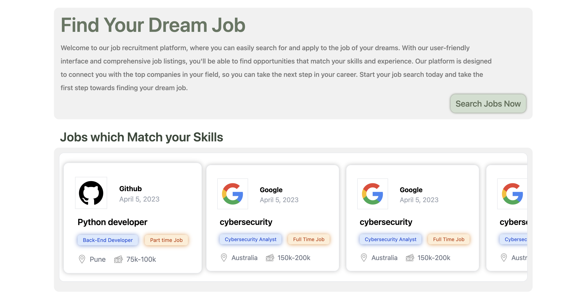
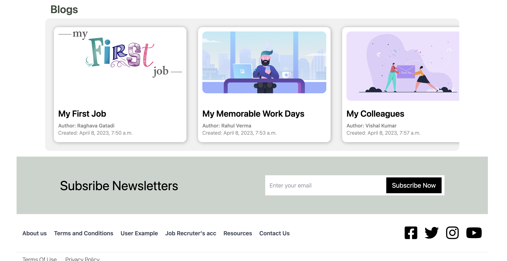
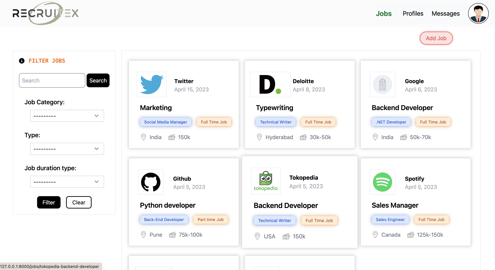
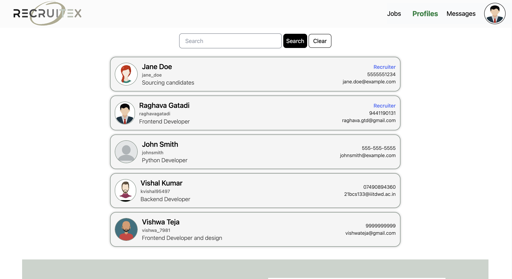
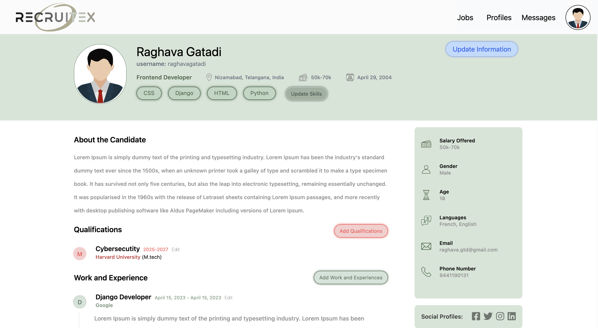
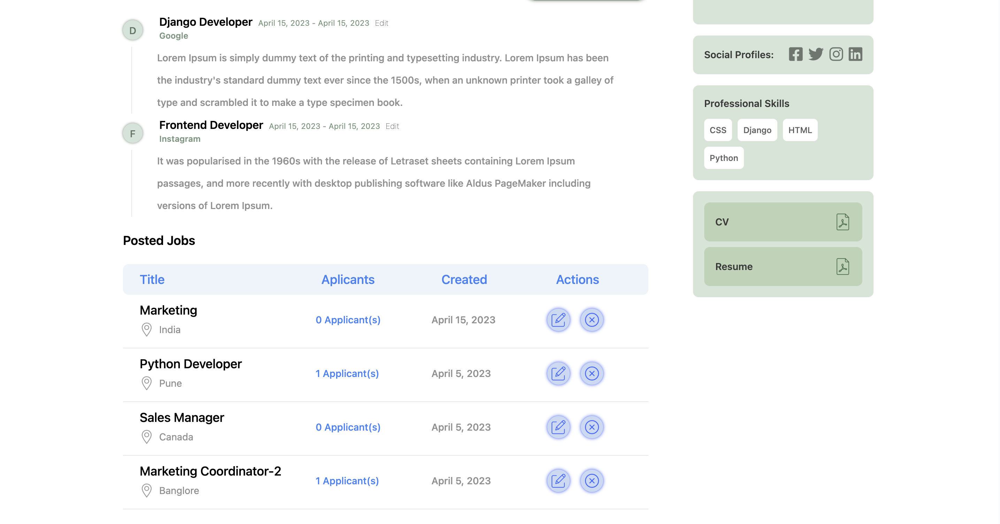
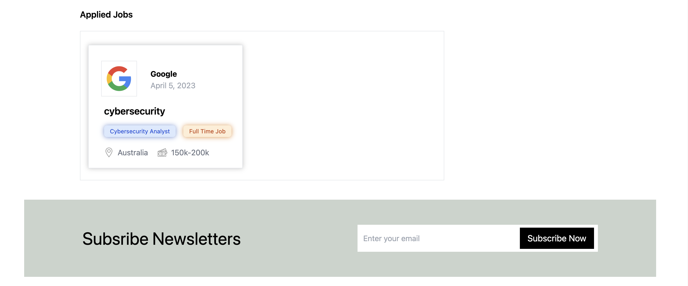

# Recruitex
- This project is done as part of our semester course and developed in team
## Steps to run project
- Clone the repository in to your pc 
- switch on the virtual environment using command 'source env/bin/activate'
- go to directory recruitex and then start server using 'python manage.py runsever'

## Images of this website
### Home Page

### Jobs search page

### profile search page

### user profile page

### contact us page

